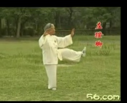
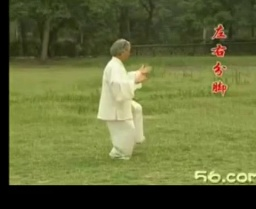
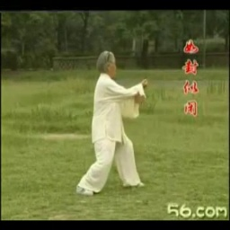
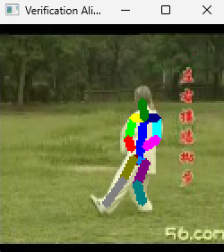
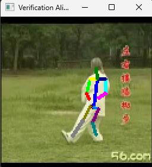
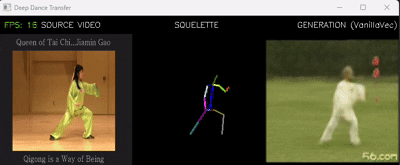
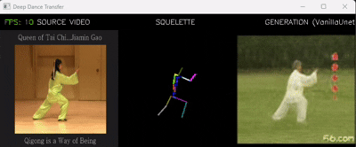

# TP – Posture-guided Image Synthesis of a Person

Ce projet explore la synthèse d’images guidée par la posture à travers une approche progressive. 
Après une méthode simple de correspondance par similarité, nous étudions deux architectures neuronales « vanilla » basées sur différentes représentations du squelette. 
Le projet aboutit à un GAN conditionnel où le squelette cible remplace le bruit aléatoire afin de générer des images cohérentes et visuellement réalistes.

---

## 1. Neareast

Dans ce premier générateur (Nearest), nous récupérons le squelette de la vidéo source à chaque frame.

Ce squelette est ensuite comparé à l'ensemble des postures de la vidéo cible via une distance euclidienne. 
L’image correspondant au squelette le plus proche est alors sélectionnée et affichée.

Cette approche ne génère pas de nouveaux pixels, mais elle a été essentielle pour valider le pipeline du projet. 
Elle nous a permis de maîtriser la manipulation des squelettes réduits (26 points) et l’extraction des paires images/squelettes.

---

## 2. Préparation des Données

### 2.1 Extraction des images et des squelettes

Avant de détailler les générateurs, il est essentiel d'expliquer comment nous avons construit notre dataset d'entraînement.

Les vidéos utilisées (Taichi) présentent de lents mouvements continus.  
Il n’est donc pas nécessaire d’extraire toutes les images de la vidéo originale.

Nous avons choisi d’extraire **une image toutes les 3 frames** (`modFrame=3`), ce qui représente un bon compromis :

- Peu de différence entre deux images consécutives à court intervalle.
- Réduction de la redondance dans les données.
- Taille du dataset suffisante pour l’apprentissage.

Au total, nous obtenons **4989 paires image / squelette** pour l’entraînement.

> Remarque : pour un sport rapide (ex. danse énergique, boxe), un échantillonnage plus dense serait nécessaire afin de mieux capturer la continuité temporelle des mouvements.

### 2.2 Uniformisation du Padding et Marge de Sécurité

Nous avons identifié deux problèmes majeurs dans le prétraitement initial :
1.  **Instabilité du Padding** : Le padding changeait constamment de place (haut, bas, gauche) selon la posture, perturbant l'apprentissage.
2.  **Coupure des membres** : Un cadrage trop serré pouvait "amputait" les mains ou les pieds lors de mouvements amples.

| Padding variable (Haut) | Padding variable (Bas) |
| :---: | :---: |
|  |  |

#### Solutions apportées

Pour résoudre ces problèmes, nous avons combiné deux approches :

1.  **Passage à un `cropRatio` de 1.3 (Marge de sécurité)** :
    En "dézoomant" le sujet, nous créons une zone tampon autour du squelette. Cela garantit que le personnage reste entier dans le cadre, même lorsqu'il tend les bras ou se déplace, évitant ainsi de perdre des informations cruciales sur les extrémités.

2.  **Normalisation du Padding** :
    Nous avons modifié `VideoSkeleton` pour imposer un positionnement fixe. Le sujet est centré de manière cohérente, offrant au générateur des données stables.

*Résultat final : une image centrée avec une marge de respiration adéquate.*



### 2.3 Choix de la résolution (128×128)

Après plusieurs tests, nous avons standardisé nos images en **128×128**. C'est le compromis idéal pour notre projet :
* **Pourquoi pas 64×64 ?** La résolution était trop faible pour que le réseau apprenne correctement les détails et la fluidité des mouvements.
* **Pourquoi pas 256×256 ?** Le temps d'entraînement explosait sans gain significatif.

Le format 128×128 offre donc le meilleur équilibre entre **qualité visuelle** et **vitesse d'apprentissage**.


### 2.4 Affinage du Squelette

Pour s'adapter à cette résolution de 128 pixels, nous avons dû réduire l'épaisseur du tracé du squelette de **4 à 2 pixels**.

Avec un tracé trop épais, les membres avaient tendance à fusionner visuellement lorsque le personnage pliait les bras ou croisait les mains. 
En affinant le trait (`thickness=2`), nous permettons au réseau de mieux distinguer chaque membre et de comprendre la géométrie fine des articulations, même aux extrémités comme les mains.

| Avant (Épaisseur 4) | Après (Épaisseur 2) |
| :---: | :---: |
|  |  |
| *Confusion visuelle aux jointures* | *Meilleure distinction des mouvements* |


### 2.5 Optimisations Matérielles (RTX 4060)

Disposant d'une **NVIDIA RTX 4060**, nous avons cherché à exploiter le matériel à son maximum via plusieurs optimisations :

* **Data Caching** : Pré-chargement complet du dataset en RAM pour éliminer la latence disque et nourrir le GPU instantanément.
* **Tensor Cores** : Activation du *Mixed Precision* (AMP), du format TF32 et de la mémoire *Channels Last* pour accélérer drastiquement les calculs matriciels.
* **CuDNN Benchmark** : Sélection automatique par PyTorch des algorithmes de convolution les plus rapides pour notre résolution fixe.


En poussant les modèles pendant l’entraînement, nous avons rapidement été limités par la mémoire GPU. 
Ce TP nous a fait comprendre pourquoi NVIDIA est aujourd’hui aussi dominant et connaît un tel succès avec l’essor de l’intelligence artificielle.

---

## 3 Vanilla 1 – GenNNSke26ToImage

#### Version V1 – Approche naïve (DCGAN)

La première version du générateur reposait sur une architecture **DCGAN classique**.

Le vecteur de 26 points du squelette était d’abord projeté par des couches entièrement connectées, 
puis transformé en image uniquement à l’aide de `ConvTranspose2d`. Cette approche s’est rapidement montrée limitée :

* Apparition d’**artefacts visuels**.
* Difficulté du réseau à reconstruire les mouvements (floue).

En pratique, le modèle apprenait des formes locales, mais échouait à comprendre les mouvements.

#### Version V2 – Architecture améliorée

Pour la version finale, nous avons repris les bonnes pratiques validées sur notre GenNNSkeImToImage :

* Remplacement des `ConvTranspose2d` par `Upsample` + `Conv2d` (réduction des artefacts).
* Ajout de **Residual Blocks** pour stabiliser l’apprentissage.
* Intégration de **SE Blocks** pour améliorer la qualité des textures et des couleurs.

La faible dimension de l’entrée vectorielle nous a également permis d’ajouter un module de **Self-Attention**. 
Celui-ci apporte une vision plus globale du squelette.

---

## 4 Vanilla 2 – GenNNSkeImToImage

### 4.1 Data Augmentation (Réduction du sur-apprentissage)

Afin d’améliorer la robustesse du modèle et de limiter le sur-apprentissage, plusieurs techniques de *data augmentation* ont été appliquées aux images d’entrée avant leur passage dans le réseau :

- **ColorJitter** : De légères variations de luminosité, de contraste et de saturation sont introduites pour rendre le modèle moins sensible aux conditions d’éclairage.
- **Normalize** : Les images sont normalisées dans l’intervalle `[-1, 1]`, conformément à l’activation *Tanh* utilisée en sortie du générateur.
- **RandomErasing** : Certaines zones de l’image sont supprimées aléatoirement afin d’encourager le réseau à exploiter une information plus globale plutôt que de se focaliser sur des détails locaux.

Ces transformations contribuent à améliorer la capacité de généralisation du modèle, en particulier lorsque le nombre d’images disponibles est limité.

### 4.2 Optimisations Architecturales

#### Améliorations retenues
Plusieurs choix architecturaux ont été validés expérimentalement et intégrés dans le modèle final :

- **Profondeur de l'Espace Latent (512 canaux)** : Bien que la résolution de sortie soit modeste (128x128), nous avons choisi de monter jusqu'à **512 filtres** dans le *bottleneck*. Nos tests comparatifs ont montré une nette différence de qualité par rapport à une limite de 256 filtres.
- **Upsampling + Convolution** : Cette approche a été préférée à *ConvTranspose2d*, car elle permet de réduire les artefacts de type « checkerboard », un problème bien connu dans la génération d’images.
- **Reflection Padding** : Utilisé pour limiter les artefacts aux bordures, il offre de meilleurs résultats visuels que le padding zéro classique.
- **Instance Normalization** : Contrairement à la *Batch Normalization*, cette normalisation traite chaque image indépendamment, ce qui s’est avéré plus adapté pour la génération d’images et la préservation du style.
- **Fonction de perte 10 * L1 + 0.5 * VGG** : L’utilisation exclusive de pertes pixel-à-pixel (L1 ou MSE) conduisait à des images trop floues. L’ajout d’une perte perceptuelle basée sur VGG permet d’améliorer la netteté.
- **Squeeze-and-Excitation (SE Block)** : Ce mécanisme d’attention par canal a été conservé, car il améliore rapidement la richesse des couleurs et le contraste, pour un surcoût en calcul très limité.
- **Blocs ResNet (Bottleneck)** : Ils facilitent l’apprentissage des transformations géométriques complexes et contribuent à une meilleure continuité des mouvements.
- **ReLU (Encodeur)** : bien que LeakyReLU (0.2) soit fréquemment recommandé dans la littérature, nos expérimentations ont montré que l’utilisation d’un ReLU standard dans l’encodeur produisait de meilleurs résultats sur ce jeu de données.
- **Skip Connections** : Elles permettent de conserver les détails fins issus de l’encodeur et d’améliorer la qualité globale des images générées.

#### Choix testés, mais non retenus

- **Self-Attention** : Cette technique a été évaluée, mais son impact sur la qualité visuelle finale s’est révélé limité dans notre cas. En revanche, elle entraînait une augmentation significative du coût de calcul et du temps d’entraînement. 
Elle a donc été abandonnée au profit d’une architecture plus légère.

---

## 5. GAN Generator

### 5.1 Architecture du Discriminateur (PatchGAN Amélioré)

Le discriminateur joue un rôle crucial dans la stabilité du WGAN-GP. Plutôt qu'un simple classifieur binaire, nous avons opté pour une architecture **PatchGAN** enrichie de mécanismes de régularisation et d'attention.

#### Choix Techniques & Stabilisation

- **PatchGAN (70x70)** : Le réseau ne juge pas l'image entière d'un coup, mais classifie des parcelles locales (*patches*) comme "réelles" ou "fausses". Cela force le générateur à soigner les textures haute fréquence (détails nets).
- **Dropout Stratégique (0.3)** : Insertion de couches de *Dropout* (30%) dans les blocs intermédiaires. Cela empêche le discriminateur de devenir "trop fort" trop vite, évitant ainsi l'effondrement du gradient (*vanishing gradient*) pour le générateur.
- **Instance Normalization** : Utilisée à la place de la *BatchNorm* pour stabiliser l'entraînement sur des batchs de petite taille et respecter l'indépendance des échantillons.
- **Modules d'Attention Hybrides** :
  - **SE Block (Squeeze-and-Excitation)** : Intégré dans les couches les plus profondes (**256 et 512 filtres**) pour recalibrer l'importance des canaux et se concentrer sur les caractéristiques les plus pertinentes.
  - **Self-Attention** : Placé dans la dernière couche de convolution (avant la sortie) pour capturer les dépendances spatiales à longue portée (cohérence globale de la silhouette), là où les convolutions classiques sont limitées à leur champ récepteur local.

### 5.2 Stratégie d'Entraînement et Fonction de Coût (Loss)

La génération d'humains réalistes à partir de squelettes est un problème complexe qui nécessite d'équilibrer la structure (la pose doit être exacte) et la texture (vêtements, peau). Pour y parvenir, nous avons conçu une **Fonction de Coût Composite** et adopté les hyperparamètres du **WGAN-GP**.

#### 5.3 La Fonction de Coût Composite (Generator Loss)
Le générateur minimise une somme pondérée de trois pertes distinctes. La formule finale retenue est :

> **Loss_G = 3.0 × Loss_Adv + 8.0 × Loss_L1 + 0.3 × Loss_VGG**

Nous avons empiriquement déterminé les poids suivants pour atteindre le point d'équilibre :

* **Poids Adversarial (3.0)** :
    * *Rôle* : Force le générateur à produire des images "trompeuses" pour le discriminateur.
    * *Choix* : Un poids élevé de **3** a été choisi pour favoriser la netteté haute fréquence et éviter l'aspect "lissé" du générateur, mais c'est peut-être un peu trop élevé.

* **Poids L1 (8.0)** :
    * *Rôle* : Calcule la différence absolue pixel à pixel entre l'image générée et l'image réelle.
    * *Choix* : Fixé à **8**, ce poids agit comme une ancre structurelle. Il garantit que la pose du squelette et les couleurs globales sont respectées.

* **Poids Perceptuel VGG (0.3)** :
    * *Rôle* : Compare les caractéristiques extraites par un réseau VGG-16 pré-entraîné plutôt que les pixels bruts.
    * *Choix* : Ce poids de **0.3** permet d'améliorer la perception des textures et réduit l'effet de flou inhérent à la perte L1.

#### 5.4 Stabilisation via WGAN-GP (Discriminator)

Pour contrer l'instabilité notoire des GANs, nous utilisons l'approche **Wasserstein GAN avec Gradient Penalty**.

* **Critique (n_critic = 4)** : Le discriminateur est mis à jour **4 fois** pour chaque mise à jour du générateur. Cela garantit que le discriminateur fournit une estimation fiable de la distance de Wasserstein, guidant le générateur plus efficacement qu'un discriminateur "faible".
* **Gradient Penalty (lambda_gp = 10)** : Le coefficient standard de pénalité de gradient, forçant le discriminateur à respecter la contrainte 1-Lipschitz (évite l'explosion des gradients).

#### 5.5 Optimisation

* **Learning Rate** : `0.0001` (Standard pour WGAN, plus stable que le `0.0002` des DCGANs).
* **Optimiseur Adam** : `Betas = (0.0, 0.9)`. Le paramètre Beta1 à **0.0** est crucial pour le WGAN-GP afin d'éviter les oscillations de momentum qui déstabiliseraient l'entraînement.

## 6. Aperçu des Résultats et Analyse

Cette section présente une comparaison visuelle entre nos trois approches principales. Les GIFs ci-dessous illustrent l'évolution qualitative de la génération.

### 6.1 Vanilla 1 – Approche Vectorielle (GenNNSke26ToImage)



**Analyse :**

Comme on peut le constater, le réseau éprouve de grandes difficultés à gérer la cohérence des mouvements. Bien que la forme globale soit à peu près respectée, le modèle n'arrive pas à interpoler correctement les gestes.

L'entrée constituée d'un vecteur plat de **26 coordonnées (x,y)** est trop pauvre en information spatiale. Le réseau ne voit pas la structure du corps dans l'espace, ce qui limite considérablement sa capacité d'apprentissage.

---

### 6.2 Vanilla 2 – Approche Image-to-Image (GenNNSkeImToImage)



**Analyse :**

Le passage d'un vecteur à une image squelette et les différentes améliorations ont porté leurs fruits.

Les mouvements sont désormais fluides et cohérents. Le réseau parvient à mapper la position spatiale du squelette vers la texture du personnage. C'est un résultat qui tient la route.

---

### 6.3 Approche WGAN-GP


**Analyse :**

L'ajout du discriminateur apporte une netteté supérieure, notamment dans la définition des contours lors des mouvements rapides, surpassant le modèle Vanilla 2.

On remarque l'apparition d'artefacts visuels sous forme de lueur jaune sur le personnage.

Cet effet est probablement dû au poids élevé attribué à la perte adversariale (3.0 × Loss_Adv) Bien que cela force la netteté, le discriminateur pousse le générateur à des valeurs de pixels extrêmes pour le tromper, créant ces artefacts. 
Un rééquilibrage (ex: descendre à 1 ou 2) pourrait corriger ce défaut tout en gardant la structure.

## Lancer le code

Les dépendances sont identiques à celles fournies au début du TP.
Nous avons réalisé un script principal (`main.py`) à la racine du projet qui permet d'avoir une interface directement dans le terminal.

Il suffit d'ouvrir un terminal à la racine du projet et d'exécuter la commande suivante :

```python .\main.py```

### Fonctionnement

Une fois le script lancé, suivez simplement les instructions à l'écran. Le menu vous guidera à travers les étapes suivantes :

1. **Préparation** :
   Si votre vidéo n'est pas celle par défaut (`taichi1`), choisissez cette option pour extraire les squelettes/images et créer le dataset `.pkl`.

2. **Entraînement** :
   Choisissez votre dataset et le type de générateur souhaité

3. **Génération (Démo)** :
   Choisissez une **vidéo source** (qui donne le mouvement), le **personnage cible** (`taichi1.pkl` ou le vôtre) et le **générateur correspondant** pour visualiser le résultat final.